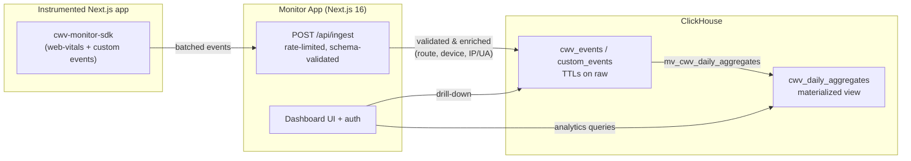
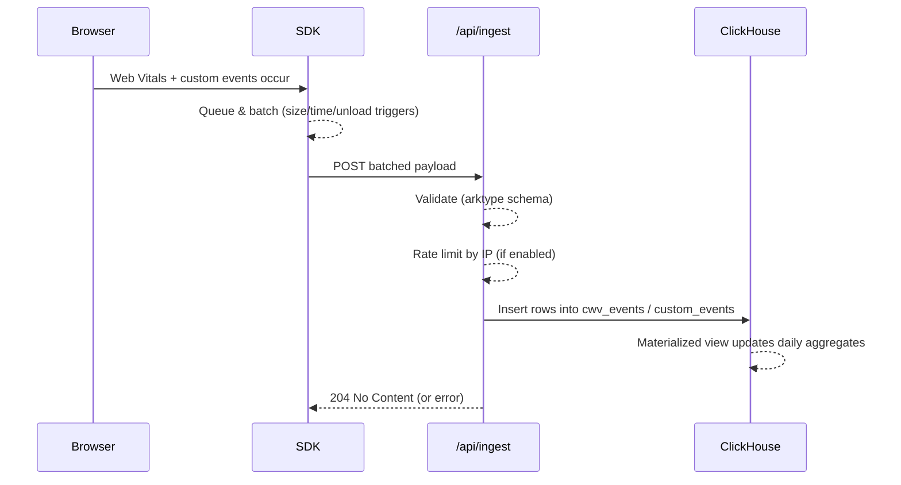

  

# Architecture

Technical overview of how Next CWV Monitor is built: what it is, why it’s shaped this way, and how the main pieces talk to each other.

## System goals (why)
- Route-aware Core Web Vitals (CWV) with real user monitoring (RUM) tailored to Next.js.
- Self-hosted by default: zero SaaS dependencies, predictable costs, data stays on your infra.
- Low client overhead: tiny SDK, aggressive batching, best-effort delivery on unload.
- Fast, affordable analytics at scale: append-only writes + long retention with ClickHouse TTLs.
- Multi-tenant & role-based: multiple projects per deployment, Better Auth-backed access control.

## Monorepo at a glance (what)
- `apps/monitor-app` — Next.js 16 dashboard + APIs (ingest, auth, health, projects).
- `apps/client-app` — Sample Next.js site that ships demo traffic.
- `packages/client-sdk` — Browser SDK (App Router & Pages Router entrypoints, batching, privacy).
- `packages/cwv-monitor-contracts` — Shared schemas (ingest payloads) used by SDK and server.
- `apps/monitor-app/clickhouse` — Migrations and schema docs for the analytics warehouse.
- `docker/monitor` — Dev/prod Docker Compose stacks (ClickHouse + monitor app + migrations/seed).
- `docs/screenshots` — UI previews referenced in README.

## High-level data flow (how)

## Components

### Client SDK (`packages/client-sdk`)
- Next.js-first: router-aware entrypoints (`app-router`, `pages-router`) to derive normalized routes.
- Captures CWV (LCP, FID, CLS, INP, TTFB, FCP), page views, and custom business events.
- Privacy-minded: in-memory session id per page view (no cookies/storage) and per-view sampling.
- Batching: sends to `POST /api/ingest` when queue ≥10, 50ms after last event, or on page unload.
- Transport: lightweight fetch/sendBeacon; retries rely on batching + unload best-effort.
- Contracts: payload schema comes from `cwv-monitor-contracts` to prevent drift with the backend.

### Monitor App (`apps/monitor-app`)
- Next.js 16 App Router for both UI and API routes; server actions back most mutations.
- AuthN/AuthZ: Better Auth with role-based access; ClickHouse-backed adapter.
- Ingest pipeline:
  - Endpoint: `/api/ingest` with CORS, trust-proxy toggle, and IP-based rate limiting.
  - Validation: `IngestPayloadV1Schema` (arktype) from shared contracts.
  - Mapping: enriches events with project lookup, device classification, IP/UA hints, timestamps.
  - Persistence: writes to ClickHouse tables (`cwv_events`, `custom_events`).
- Analytics:
  - Materialized view `mv_cwv_daily_aggregates` maintains daily percentile states (`quantilesState`).
  - Dashboard queries read aggregates by project/route/device/metric; drill-down hits raw tables when needed.
- Observability & hardening:
  - Health probe `/api/health` (not shown here) for readiness checks.
  - CORS defaults to `*` for ingest until per-project domains are added; `TRUST_PROXY` guards IP headers.

### ClickHouse warehouse (`apps/monitor-app/clickhouse`)
- Tables: `projects`, `cwv_events`, `custom_events`, `cwv_daily_aggregates` plus Better Auth tables.
- Storage design:
  - Append-only `MergeTree` for events with monthly partitions and 90d TTL on raw facts.
  - `AggregatingMergeTree` for daily percentiles with 365d retention.
  - `ReplacingMergeTree(updated_at)` for dimensions/auth to enable cheap upserts.
  - `LowCardinality` columns for enums; data-skipping indexes for frequent lookups.
- Migrations: run automatically via the `migrations` service in Docker Compose; materialized view populates aggregates.

### Demo client (`apps/client-app`)
- Simple Next.js app that ships synthetic traffic to showcase dashboards; runs on port 3001 in dev.

### Contracts package (`packages/cwv-monitor-contracts`)
- Shared TypeScript schema for ingest payloads, imported by both the SDK and the monitor app to keep validation consistent.

## Request lifecycle (ingest)

## Deployment topologies
- **Local dev:** `pnpm docker:dev` → ClickHouse + migrations + seed + monitor app on port 3000; live-reloads via volume mounts.
- **Production:** `pnpm docker:prod` → clickhouse + migrations + monitor app built from `monitor-app.prod.Dockerfile`; set `AUTH_BASE_URL`, `TRUST_PROXY`, `BETTER_AUTH_SECRET`, and ClickHouse creds.
- Data persistence: ClickHouse volumes (`clickhouse-*`) retain data between restarts.

## Extending / operating
- Add new metrics: extend `cwv-monitor-contracts` schema, update SDK emitters, and add ClickHouse columns + migrations.
- Custom event taxonomy: events are arbitrary strings; use route + device dimensions for slicing.
- Retention: adjust TTLs in migrations if you need longer raw retention; aggregates are cheaper to keep.
- Security: scope CORS for `/api/ingest` once per-project domains are available; keep `TRUST_PROXY=false` unless behind a trusted proxy.

## References
- SDK usage: `packages/client-sdk/README.md`
- Warehouse schema: `apps/monitor-app/clickhouse/SCHEMA.md`
- Deployment: `docker/monitor/docker-compose.*.yml`

