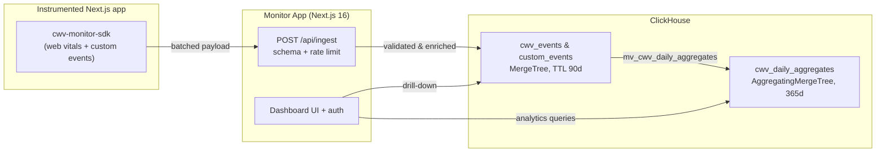
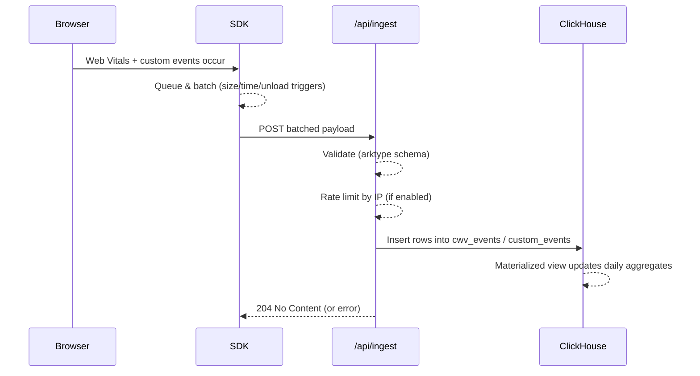

<p align="center">
  
</p>

# ARCHITECTURE.md

Architecture overview for Next CWV Monitor, organized using the structure from the public template at [architecture.md](https://architecture.md/).

## 1. Project Structure

```
next-cwv-monitor/
├── apps/
│   ├── monitor-app/              # Next.js 16 dashboard & API
│   │   ├── src/
│   │   │   ├── app/              # App Router pages & routes
│   │   │   │   ├── (protected)/  # Auth-gated dashboard views
│   │   │   │   ├── api/          # API routes (ingest, auth, health)
│   │   │   │   └── server/       # Server actions & domain logic
│   │   │   ├── components/       # UI components (dashboard, events, users)
│   │   │   ├── contexts/         # React contexts (session)
│   │   │   └── lib/              # Utilities (auth, cache, ClickHouse adapter)
│   │   ├── clickhouse/
│   │   │   └── migrations/       # SQL migrations for schema setup
│   │   └── scripts/              # Seed & migration runners
│   └── client-app/               # Demo Next.js app generating sample traffic
│       └── src/
│           ├── app/              # App Router demo pages
│           └── pages/            # Pages Router demo pages
├── packages/
│   ├── client-sdk/               # Browser SDK for CWV collection
│   │   └── src/
│   │       ├── hooks/            # useMetrics, useIngestQueue, useTrackCustomEvent
│   │       ├── next-route-tracker/ # Route detection for App/Pages Router
│   │       └── utils/            # Batching, session, invariant helpers
│   └── cwv-monitor-contracts/    # Shared ingest payload schemas (arktype)
│       └── src/ingest/
├── docker/
│   └── monitor/
│       ├── docker-compose.dev.yml   # Dev stack (hot reload)
│       ├── docker-compose.yml       # Prod stack
│       └── dockerfiles/
├── docs/
│   └── screenshots/              # Dashboard preview images
├── CODE_STYLE.md                 # Coding conventions
├── CONTRIBUTING.md               # Contribution guide
├── DEPLOYMENT.md                 # Production deployment guide
└── README.md                     # Project overview
```

## 2. High-Level System Diagram





## 3. Core Components

### 3.1. Frontend: Monitor App (`apps/monitor-app`)

**Description:** The main user interface for viewing Core Web Vitals dashboards, managing projects, and administering users. Built with Next.js 16 App Router using server actions for mutations.

**Technologies:** Next.js 16, React, Tailwind CSS, shadcn/ui, Better Auth

**Deployment:** Docker container via `monitor-app.prod.Dockerfile`

### 3.2. Client SDK (`packages/client-sdk`)

**Description:** Lightweight browser SDK that collects CWV metrics (LCP, FID, CLS, INP, TTFB, FCP), automatic `$page_view` events, and custom business events. Provides router-specific entrypoints for App Router and Pages Router.

**Technologies:** TypeScript, web-vitals, React hooks

**Key Features:**

- Router-aware route normalization (e.g., `/blog/[slug]`)
- Privacy-first: in-memory session ID per page view, no cookies/localStorage
- Smart batching: flushes on queue size ≥10, 50ms idle, or page unload (sendBeacon)

### 3.3. Backend Services

#### 3.3.1. Ingest API (`/api/ingest`)

**Description:** Receives batched CWV and custom events from the SDK, validates payloads, applies rate limiting, enriches with device/IP/timestamp data, and persists to ClickHouse.

**Technologies:** Next.js API routes, arktype validation

**Key Features:**

- CORS support (configurable per-project in future)
- IP-based rate limiting
- `TRUST_PROXY` support for forwarded headers

#### 3.3.2. Auth API (`/api/auth`)

**Description:** Better Auth endpoints for authentication flows (login, signup, session management).

**Technologies:** Better Auth, ClickHouse adapter

### 3.4. Demo Client (`apps/client-app`)

**Description:** Sample Next.js application demonstrating SDK integration for both App Router and Pages Router. Generates synthetic traffic for dashboard demos.

**Technologies:** Next.js, cwv-monitor-sdk

**Deployment:** Port 3001 in development

### 3.5. Contracts Package (`packages/cwv-monitor-contracts`)

**Description:** Shared TypeScript schemas for ingest payloads using arktype. Ensures SDK and backend stay in sync on payload structure.

**Technologies:** TypeScript, arktype

## 4. Data Stores

### 4.1. ClickHouse (Primary Analytics Database)

**Type:** ClickHouse 25.8

**Purpose:** High-performance analytics storage for CWV events, custom events, and pre-aggregated daily statistics.

**Key Tables:**

| Table                                        | Engine               | Purpose                  | TTL      |
| -------------------------------------------- | -------------------- | ------------------------ | -------- |
| `projects`                                   | ReplacingMergeTree   | Project definitions      | —        |
| `cwv_events`                                 | MergeTree            | Raw CWV metrics          | 90 days  |
| `custom_events`                              | MergeTree            | Custom business events   | 90 days  |
| `cwv_daily_aggregates`                       | AggregatingMergeTree | Pre-computed percentiles | 365 days |
| `user`, `session`, `account`, `verification` | ReplacingMergeTree   | Better Auth tables       | varies   |

**Design Rationale:**

- **Multi-tenant first:** `project_id` in every table and sort key
- **Append-only events:** Plain MergeTree for fast writes
- **Pre-aggregated quantiles:** `quantilesState()` for efficient p50/p75/p90/p95/p99 queries
- **TTL-based retention:** Automatic cleanup without manual intervention
- **LowCardinality:** Optimized storage for enum-like fields (metric_name, device_type)

### 4.2. Docker Volumes

**Purpose:** Persist ClickHouse data between container restarts.

**Volumes:**

- `clickhouse-data` / `clickhouse-dev-data` — Database files
- `clickhouse-logs` / `clickhouse-dev-logs` — Server logs

## 5. External Integrations / APIs

**None required by default.** The system is fully self-hosted with no external dependencies.

**Optional:**

- Reverse proxy (nginx, Caddy, Traefik) for TLS termination
- Load balancer for horizontal scaling

## 6. Deployment & Infrastructure

**Cloud Provider:** Self-hosted (any Docker-capable environment)

**Key Services:**

- Docker & Docker Compose
- ClickHouse (containerized)
- Next.js (containerized or standalone)

**CI/CD Pipeline:** Not included; integrate with your preferred CI (GitHub Actions, GitLab CI, etc.)

**Deployment Modes:**

| Mode        | Command            | Description                  |
| ----------- | ------------------ | ---------------------------- |
| Development | `pnpm docker:dev`  | Hot reload, seeded demo data |
| Production  | `pnpm docker:prod` | Optimized build, no seed     |

**Environment Variables:**

| Variable             | Required | Description                                 |
| -------------------- | -------- | ------------------------------------------- |
| `AUTH_BASE_URL`      | Yes      | Public URL for auth callbacks               |
| `BETTER_AUTH_SECRET` | Yes      | Auth secret (use `openssl rand -base64 32`) |
| `TRUST_PROXY`        | No       | Enable forwarded header trust               |
| `CLICKHOUSE_*`       | Yes      | Database connection settings                |

## 7. Security Considerations

**Authentication:** Better Auth with email/password; role-based access (admin, user)

**Authorization:** Role checks on server actions and protected routes

**Data Encryption:**

- TLS in transit (configure via reverse proxy)
- ClickHouse supports encryption at rest (configure separately)

**Key Security Practices:**

- IP-based rate limiting on ingest endpoint
- `TRUST_PROXY=false` unless behind trusted proxy
- Session tokens stored in ClickHouse with TTL expiration
- No PII in SDK payloads (ephemeral session IDs only)

**CORS:** Currently permissive (`*`) for ingest; per-project domain scoping planned.

## 8. Development & Testing Environment

**Local Setup:** See [Quick Start](./README.md#-quick-start)

```bash
# Prerequisites: Node 20+, pnpm 10.1+, Docker
pnpm install
pnpm docker:dev
```

**Testing Frameworks:**

- Vitest (unit & integration tests)
- React Testing Library (component tests)

**Code Quality Tools:**

- ESLint
- Prettier
- TypeScript strict mode

**Storybook:** Available in `apps/monitor-app/src/stories/`
