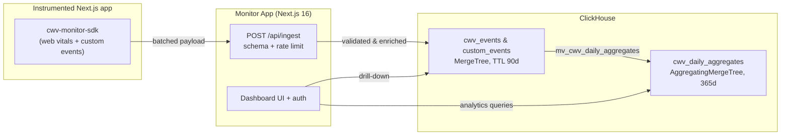
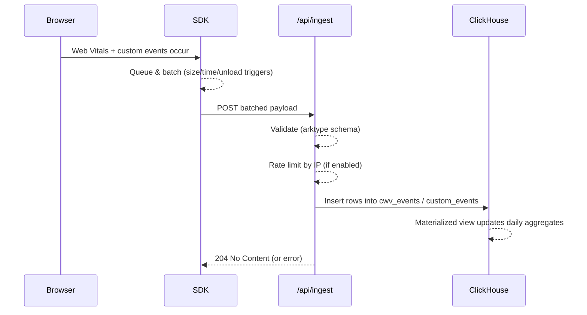

<p align="center">
  
</p>

# Architecture

System design overview for Next CWV Monitor - a self-hosted Core Web Vitals monitoring platform for Next.js.

## 1. Project Structure

```
next-cwv-monitor/
├── apps/
│   ├── monitor-app/              # Next.js 16 dashboard & API
│   │   ├── src/
│   │   │   ├── app/              # App Router pages & routes
│   │   │   │   ├── (protected)/  # Auth-gated dashboard views
│   │   │   │   ├── api/          # API routes (ingest, auth, health)
│   │   │   │   └── server/       # Server actions & domain logic
│   │   │   ├── components/       # UI components (dashboard, events, users)
│   │   │   ├── contexts/         # React contexts (session)
│   │   │   └── lib/              # Utilities (auth, cache, ClickHouse adapter)
│   │   ├── clickhouse/
│   │   │   └── migrations/       # SQL migrations for schema setup
│   │   └── scripts/              # Seed & migration runners
│   └── client-app/               # Demo Next.js app generating sample traffic
│       └── src/
│           ├── app/              # App Router demo pages
│           └── pages/            # Pages Router demo pages
├── packages/
│   ├── client-sdk/               # Browser SDK for CWV collection
│   │   └── src/
│   │       ├── hooks/            # useMetrics, useIngestQueue, useTrackCustomEvent
│   │       ├── next-route-tracker/ # Route detection for App/Pages Router
│   │       └── utils/            # Batching, session, invariant helpers
│   └── cwv-monitor-contracts/    # Shared ingest payload schemas (arktype)
│       └── src/ingest/
├── docker/
│   └── monitor/
│       ├── docker-compose.dev.yml   # Dev stack (hot reload)
│       ├── docker-compose.yml       # Prod stack
│       └── dockerfiles/
├── docs/
│   └── screenshots/              # Dashboard preview images
├── CODE_STYLE.md                 # Coding conventions
├── CONTRIBUTING.md               # Contribution guide
├── DEPLOYMENT.md                 # Production deployment guide
└── README.md                     # Project overview
```

## 2. System Diagram





## 3. Core Components

### 3.1. Monitor App (`apps/monitor-app`)

The main dashboard for viewing Core Web Vitals, managing projects, and administering users.

- **Stack:** Next.js 16 App Router, Tailwind CSS, shadcn/ui
- **Auth:** Better Auth with role-based access (admin, user)
- **Deployment:** Docker container via `monitor-app.prod.Dockerfile`

### 3.2. Client SDK (`packages/client-sdk`)

Lightweight browser SDK that collects CWV metrics (LCP, FID, CLS, INP, TTFB, FCP), `$page_view` events, and custom business events.

- **Stack:** TypeScript, web-vitals, React hooks
- **Entrypoints:** `cwv-monitor-sdk/app-router` and `cwv-monitor-sdk/pages-router`
- **Privacy:** In-memory session ID per page view — no cookies or localStorage
- **Batching:** Flushes on queue ≥10, 50ms idle, or page unload (sendBeacon)

### 3.3. Ingest API (`/api/ingest`)

Receives batched events from the SDK, validates, enriches, and persists to ClickHouse.

- **Validation:** arktype schemas from `cwv-monitor-contracts`
- **Rate limiting:** IP-based (enable `TRUST_PROXY` behind a proxy)
- **CORS:** Currently `*`; per-project scoping planned

### 3.4. Contracts Package (`packages/cwv-monitor-contracts`)

Shared TypeScript schemas for ingest payloads. Imported by both SDK and monitor app to prevent drift.

### 3.5. Demo Client (`apps/client-app`)

Sample Next.js app demonstrating SDK integration for both routers. Runs on port 3001 in dev.

## 4. Data Store

> Full schema details: [`apps/monitor-app/clickhouse/SCHEMA.md`](./apps/monitor-app/clickhouse/SCHEMA.md)

**ClickHouse 25.8** — High-performance columnar database for analytics.

| Table                                        | Engine               | Purpose                  | TTL      |
| -------------------------------------------- | -------------------- | ------------------------ | -------- |
| `projects`                                   | ReplacingMergeTree   | Project definitions      | —        |
| `cwv_events`                                 | MergeTree            | Raw CWV metrics          | 90 days  |
| `custom_events`                              | MergeTree            | Custom business events   | 90 days  |
| `cwv_daily_aggregates`                       | AggregatingMergeTree | Pre-computed percentiles | 365 days |
| `user`, `session`, `account`, `verification` | ReplacingMergeTree   | Better Auth tables       | varies   |

**Design choices:**

- `project_id` in every table for multi-tenancy
- Append-only MergeTree for fast writes
- `quantilesState()` for efficient percentile queries (p50–p99)
- TTL-based retention for automatic cleanup
- `LowCardinality` for enum-like columns

## 5. Deployment

| Mode        | Command            | Description                  |
| ----------- | ------------------ | ---------------------------- |
| Development | `pnpm docker:dev`  | Hot reload, seeded demo data |
| Production  | `pnpm docker:prod` | Optimized build, no seed     |

**Required environment variables:**

| Variable             | Description                                 |
| -------------------- | ------------------------------------------- |
| `AUTH_BASE_URL`      | Public URL for auth callbacks               |
| `BETTER_AUTH_SECRET` | Auth secret (`openssl rand -base64 32`)     |
| `CLICKHOUSE_*`       | Database connection (host, port, user, etc) |
| `TRUST_PROXY`        | Set `true` if behind a reverse proxy        |

## 6. Security

- **Auth:** Better Auth with email/password; role-based access control
- **Rate limiting:** IP-based on ingest endpoint
- **Sessions:** Stored in ClickHouse with TTL expiration
- **SDK privacy:** Ephemeral session IDs only — no PII collected
- **CORS:** Permissive (`*`) for now; per-project domains planned

## 7. Development

**Local setup:** See [Quick Start](./README.md#-quick-start)

```bash
pnpm install
pnpm docker:dev
```

**Testing:** Vitest + React Testing Library

**Code quality:** ESLint, Prettier, TypeScript strict mode

**Storybook:** `apps/monitor-app/src/stories/`
