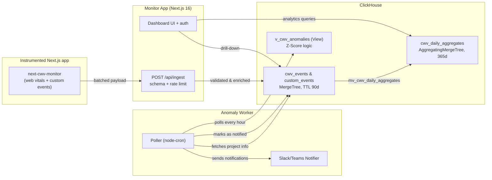

# Architecture

## 1. Project Structure

```
apps/
  monitor-app        # Next.js dashboard & API
  anomaly-worker     # Sidecar service for anomaly detection (new)

packages/
  client-sdk              # Browser SDK for CWV collection
  cwv-monitor-contracts   # Shared ingest payload schemas
```

## 2. System Diagram




## 3. Core Components

### 3.1. Monitor App (`apps/monitor-app`)

The main dashboard for viewing Core Web Vitals, managing projects, and administering users.

- **Stack:** Next.js 16 App Router, Tailwind CSS, shadcn/ui
- **Auth:** Better Auth with role-based access (admin, user)
- **Ingest API:** Receives batched events from SDK, validates via arktype schemas, rate-limits by IP, and persists to ClickHouse
- **Deployment:** Docker container via `monitor-app.prod.Dockerfile`

### 3.2. Client SDK (`packages/client-sdk`)

Lightweight browser SDK that collects CWV metrics (LCP, INP, CLS, TTFB, FCP), `$page_view` events, and custom business events.

- **Stack:** TypeScript, web-vitals, React hooks
- **Entrypoints:** `next-cwv-monitor/app-router` and `next-cwv-monitor/pages-router`
- **Privacy:** In-memory session ID per page view — no cookies or localStorage
- **Batching:** Flushes on 50ms idle or page unload/visibility change (sendBeacon)

### 3.3. Contracts (`packages/cwv-monitor-contracts`)

Shared TypeScript schemas for ingest payloads. Imported by both SDK and monitor app to prevent drift.

### 3.4. Anomaly Worker (`apps/anomaly-worker`)

A lightweight sidecar service that periodically polls ClickHouse for statistical anomalies (z_score > 3) and sends notifications.

- **Stack:** Node.js, node-cron, ClickHouse client, pino
- **Polling:** Scheduled every hour to detect new regressions
- **State:** Tracks notified anomalies in `processed_anomalies` table to prevent duplicates
- **Notifications:** Supports Slack and Microsoft Teams webhooks
- **Deployment:** Dedicated sidecar container (see `docker/anomaly-worker.Dockerfile`)

## 4. Data Store

**ClickHouse** — High-performance columnar database for analytics.

> Full schema details: [`apps/monitor-app/clickhouse/SCHEMA.md`](./apps/monitor-app/clickhouse/SCHEMA.md)

**Design choices:**

- `project_id` in every table for multi-tenancy
- Append-only MergeTree for fast writes
- `quantilesState()` for efficient percentile queries (p50–p99)
- TTL-based retention for automatic cleanup
- `LowCardinality` for enum-like columns

## 5. Deployment

| Mode        | Command                         | Description                  |
| ----------- | ------------------------------- | ---------------------------- |
| Development | `pnpm docker:dev`               | Hot reload, seeded demo data |
| Production  | [Setup wizard](./DEPLOYMENT.md) | Guided setup with SSL option |

The setup wizard downloads Docker Compose files, configures secrets automatically, and optionally sets up SSL via Caddy.

See [`DEPLOYMENT.md`](./DEPLOYMENT.md) for full configuration options and environment variables.

## 6. Security

- **Auth:** Better Auth with email/password; role-based access control
- **Rate limiting:** IP-based on ingest endpoint
- **Sessions:** Stored in ClickHouse with TTL expiration
- **SDK privacy:** Ephemeral session IDs only — no PII collected
