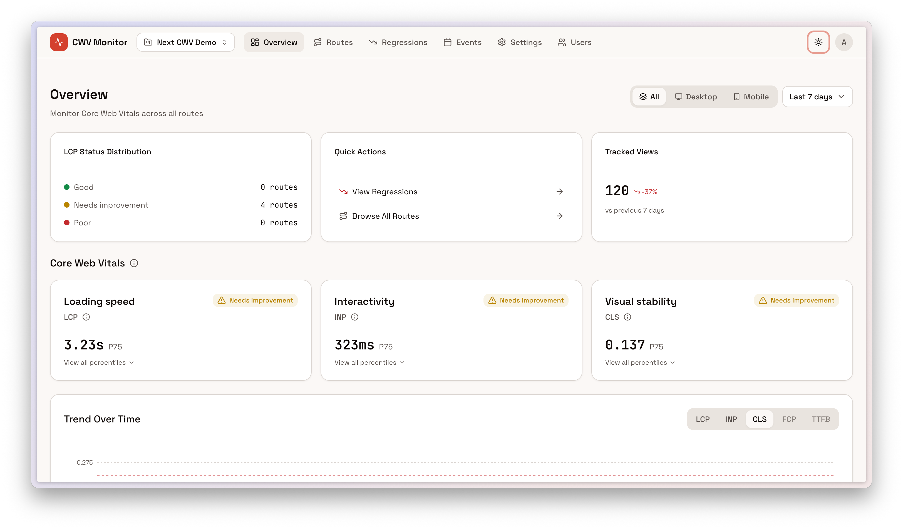
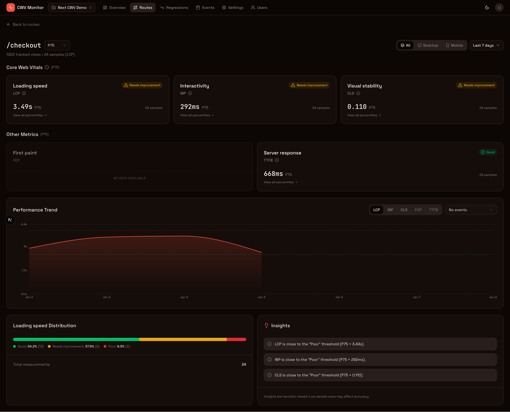

<p align="center">
  <picture>
    <source media="(prefers-color-scheme: dark)" srcset="./.assets/dark_mode.png">
    <source media="(prefers-color-scheme: light)" srcset="./.assets/light_mode.png">
    
  </picture>
</p>

<h1 align="center">next-cwv-monitor</h1>

<p align="center">
  Self-hosted Core Web Vitals monitoring for Next.js: collect performance data from real users, correlate metrics with conversion events, and see data in real-time. Free & open source.
</p>

<p align="center">
  <a href="./LICENSE"></a>
  <a href="./CONTRIBUTING.md"></a>
  <a href="./packages/client-sdk"></a>
  
  
  
</p>

<p align="center">
  <a href="https://vercel.com/new/clone?repository-url=https%3A%2F%2Fgithub.com%2FBlazity%2Fnext-cwv-monitor&env=BETTER_AUTH_SECRET,CLICKHOUSE_HOST,CLICKHOUSE_PORT,CLICKHOUSE_USER,CLICKHOUSE_PASSWORD,CLICKHOUSE_DB,INITIAL_USER_EMAIL,INITIAL_USER_PASSWORD,INITIAL_USER_NAME&envDescription=Required%20environment%20variables%20for%20the%20CWV%20Monitor.%20See%20deployment%20docs%20for%20details.&envLink=https%3A%2F%2Fgithub.com%2FBlazity%2Fnext-cwv-monitor%2Fblob%2Fmain%2FDEPLOYMENT.md%23deploy-on-vercel&project-name=cwv-monitor&repository-name=next-cwv-monitor&root-directory=apps/monitor-app"></a>
</p>

<p align="center">
  <a href="#-quick-start">Quick Start</a> •
  <a href="#-features">Features</a> •
  <a href="#-installation">Installation</a> •
  <a href="#-deploy-on-vercel">Deploy on Vercel</a> •
  <a href="#-faq">FAQ</a> •
  <a href="#-contributing">Contributing</a>
</p>

## 🎯 Overview

Google's Core Web Vitals directly impact your **SEO rankings** and **user experience**. Yet existing monitoring solutions are either expensive, lack deep Next.js integration, or don't provide route-level insights.

**next-cwv-monitor** is a **free, self-hosted alternative** purpose-built for Next.js developers:

- 🏠 **Self-hosted** — Your data stays on your infrastructure, no vendor lock-in
- 📊 **Real User Monitoring** — Capture LCP, INP, CLS, TTFB, and FCP from actual visitors
- 🎯 **Custom Events** — Correlate CWV with conversions, purchases, signups
- ⚡ **Lightweight SDK** — <5 kB gzipped, zero impact on your app's performance
- 🔒 **Privacy-first** — No cookies, no personal data, GDPR-compliant by design

## 🚀 Quick Start

**Self-hosting?** Follow the [Deployment Guide](./DEPLOYMENT.md) to run on your infrastructure.

**Contributing?** See [Contributing Guide](./CONTRIBUTING.md) for local development setup.

Add the SDK to the Next.js app you want to monitor:

```tsx
// app/providers.tsx — wrap your root layout with this provider
"use client";
import { CWVMonitor } from "next-cwv-monitor/app-router";

export function Providers({ children }: { children: React.ReactNode }) {
  return (
    <CWVMonitor
      projectId="YOUR_PROJECT_UUID" // From the dashboard
      endpoint="http://localhost:3000"
    >
      {children}
    </CWVMonitor>
  );
}
```

> 💡 Using Pages Router? Import from `next-cwv-monitor/pages-router` instead and wrap your `_app.tsx`. See [SDK docs](./packages/client-sdk/README.md) for details.

That's it! Your app will start sending CWV metrics 🎉

## ✨ Features

- 📊 **Real User Monitoring** — Capture LCP, INP, CLS, TTFB, and FCP from actual visitors
- 🛤️ **Next.js Router Integration** — Automatic route detection and normalization (`/blog/[slug]`)
- 📱 **Device Segmentation** — Filter metrics by desktop vs. mobile
- 📈 **Percentile Analysis** — View p50, p75, p90, p95, p99 distributions
- 🎯 **Custom Events** — Track business events and correlate with web vitals
- 👁️ **Page Views** — Automatic tracking for conversion analysis
- 🎛️ **Multi-project** — Monitor all your Next.js apps from one dashboard
- 🔐 **Multi-tenant Auth** — Role-based access control with Better Auth
- 🔄 **App & Pages Router** — Full support for both Next.js routing paradigms
- ⚡ **Lightweight SDK** — <5 kB gzipped, tree-shakeable, router-specific entrypoints
- 📡 **Smart Batching** — Efficient event delivery with automatic flush on idle/unload
- 🚀 **ClickHouse Backend** — Blazing fast analytics on billions of events

## 📸 Screenshots

<details>
<summary><strong>Dashboard Overview</strong></summary>
<p align="center">
  
  <br>
  <em>Dashboard overview showing CWV metrics across all routes</em>
</p>
</details>

<details>
<summary><strong>Route Detail View</strong></summary>
<p align="center">
  
  <br>
  <em>Drill down into individual routes with percentile distributions</em>
</p>
</details>

<details>
<summary><strong>Custom Events</strong></summary>
<p align="center">
  
  <br>
  <em>Track custom business events correlated with Core Web Vitals</em>
</p>
</details>

## 📦 Installation

Run the interactive setup wizard:

```bash
curl -fsSL https://raw.githubusercontent.com/Blazity/next-cwv-monitor/main/setup.sh | bash
```

The wizard downloads Docker Compose files, guides you through configuration (including optional SSL), and generates secure secrets automatically.

> 📖 For complete deployment options, see [`DEPLOYMENT.md`](./DEPLOYMENT.md).

## ▲ Deploy on Vercel

Want to skip infrastructure setup? Deploy the monitor app directly to Vercel and connect it to an external ClickHouse instance (self-hosted or [ClickHouse Cloud](https://clickhouse.com/cloud)).

<p align="center">
  <a href="https://vercel.com/new/clone?repository-url=https%3A%2F%2Fgithub.com%2FBlazity%2Fnext-cwv-monitor&env=BETTER_AUTH_SECRET,CLICKHOUSE_HOST,CLICKHOUSE_PORT,CLICKHOUSE_USER,CLICKHOUSE_PASSWORD,CLICKHOUSE_DB,INITIAL_USER_EMAIL,INITIAL_USER_PASSWORD,INITIAL_USER_NAME&envDescription=Required%20environment%20variables%20for%20the%20CWV%20Monitor.%20See%20deployment%20docs%20for%20details.&envLink=https%3A%2F%2Fgithub.com%2FBlazity%2Fnext-cwv-monitor%2Fblob%2Fmain%2FDEPLOYMENT.md%23deploy-on-vercel&project-name=cwv-monitor&repository-name=next-cwv-monitor&root-directory=apps/monitor-app"></a>
</p>

```
┌─────────────────────────────────────────────────────────────────┐
│                          VERCEL                                 │
│                    ┌─────────────────┐                          │
│                    │   Monitor App   │                          │
│                    │  (Next.js 16)   │                          │
│                    └────────┬────────┘                          │
│                             │                                   │
└─────────────────────────────┼───────────────────────────────────┘
                              │ HTTPS
                              ▼
┌─────────────────────────────────────────────────────────────────┐
│                    EXTERNAL CLICKHOUSE                          │
│             (Self-hosted or ClickHouse Cloud)                   │
│                                                                 │
│  ┌──────────────┐  ┌──────────────┐  ┌──────────────┐          │
│  │  CWV Events  │  │  Page Views  │  │ Custom Events│          │
│  └──────────────┘  └──────────────┘  └──────────────┘          │
└─────────────────────────────────────────────────────────────────┘
```

> ⚠️ **Note:** ClickHouse cannot run on Vercel — you need an external instance. See the [Vercel deployment guide](./DEPLOYMENT.md#deploy-on-vercel) for detailed setup instructions, including how to deploy the demo client app.

## ❓ FAQ

<details open>
<summary><strong>Why self-host CWV monitoring?</strong></summary>

Self-hosting gives you **full data ownership**, no per-seat pricing, custom event correlation with business metrics, and the flexibility to run on your own infrastructure with no external dependencies.

</details>

<details open>
<summary><strong>What's the performance impact of the SDK?</strong></summary>

The SDK is designed to be lightweight with tree-shakeable router-specific entrypoints. Events are batched and sent asynchronously using sendBeacon for reliable delivery without blocking navigation.

</details>

<details open>
<summary><strong>How long is data retained?</strong></summary>

Default retention: **Raw events** — 90 days, **Daily aggregates** — 365 days. Older data is automatically cleaned up by ClickHouse TTL.

</details>

## 🤝 Contributing

We welcome contributions! See [`CONTRIBUTING.md`](./CONTRIBUTING.md) for development setup, coding guidelines, and how to submit pull requests.

## 📄 License

This project is [MIT licensed](./LICENSE).

---

<p align="center">
  <sub>Built with ❤️ by <a href="https://github.com/blazity">Blazity</a></sub>
</p>
