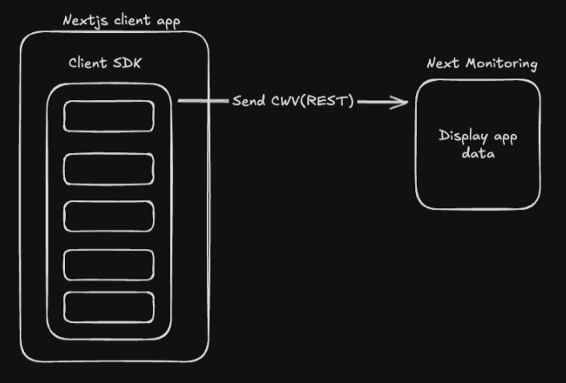
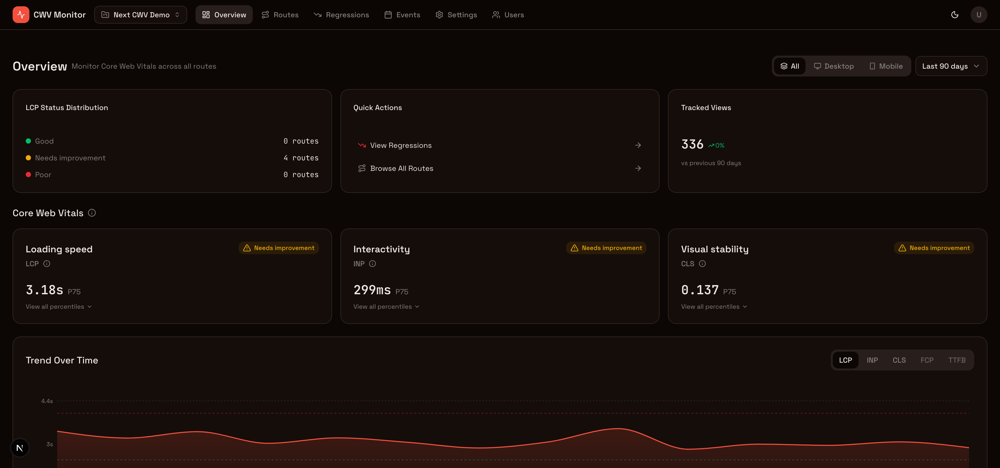
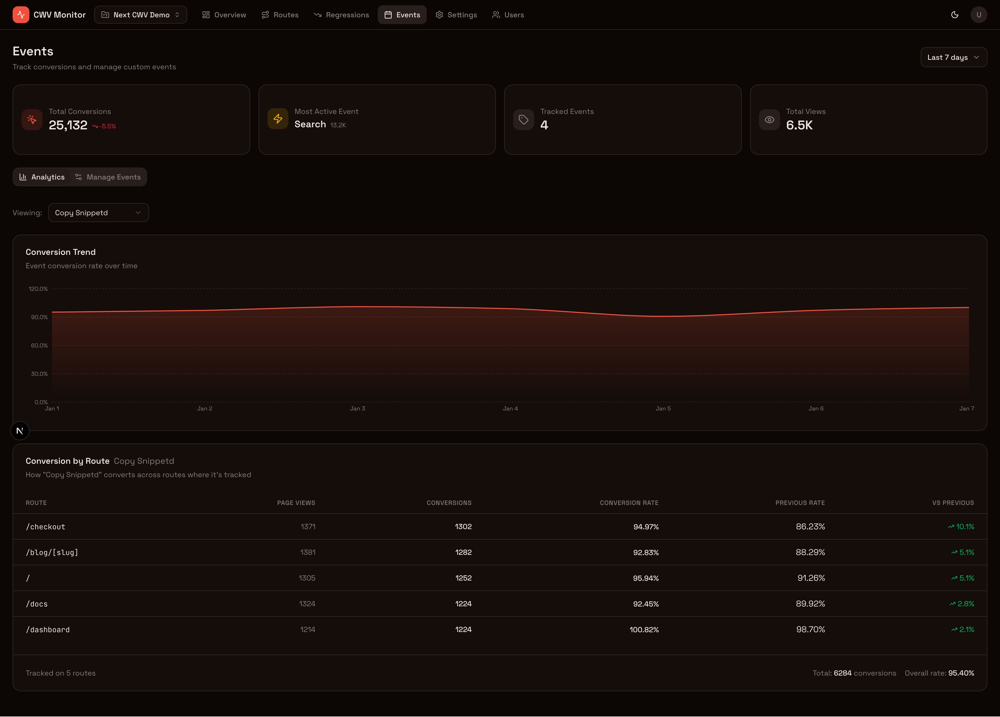

<p align="center">
  
</p>

<h1 align="center">next-cwv-monitor</h1>

<p align="center">
  <strong>Self-hosted Core Web Vitals monitoring for Next.js</strong><br>
  Real-user monitoring with route-level granularity. Free & open source.
</p>

<p align="center">
  <a href="#"></a>
  <a href="#"></a>
  <a href="#"></a>
  <a href="#"></a>
  <a href="#"></a>
</p>

<p align="center">
  <a href="#-quick-start">Quick Start</a> •
  <a href="#-features">Features</a> •
  <a href="#-installation">Installation</a> •
  <a href="#-documentation">Docs</a> •
  <a href="#-faq">FAQ</a> •
  <a href="#-contributing">Contributing</a>
</p>

---

## 🎯 Overview

Google's Core Web Vitals directly impact your **SEO rankings** and **user experience**. Yet existing monitoring solutions are either expensive, lack deep Next.js integration, or don't provide route-level insights.

**next-cwv-monitor** is a **free, self-hosted alternative** purpose-built for Next.js developers:

- 📍 **Route-aware** — See metrics for `/blog/[slug]` not just `/blog/hello-world`
- 🔗 **Business event correlation** — Connect CWV to conversions, purchases, signups
- 🏠 **Self-hosted** — Your data stays on your infrastructure
- ⚡ **Lightweight SDK** — Tree-shakeable, router-specific entrypoints
- 🎛️ **Multi-project** — Monitor all your Next.js apps from one dashboard

> 📐 For a deep dive into system design, data flow, and technical decisions, see [`ARCHITECTURE.md`](./ARCHITECTURE.md).

## 🚀 Quick Start

Get up and running in under 5 minutes:

```bash
git clone https://github.com/blazity/next-cwv-monitor.git && cd next-cwv-monitor
pnpm install
pnpm docker:dev
```

Open [http://localhost:3000](http://localhost:3000) to access the dashboard, then create a project to get your `projectId`.

Add the SDK to the Next.js app you want to monitor:

```tsx
// app/providers.tsx — wrap your root layout with this provider
"use client";
import { CWVMonitor } from "cwv-monitor-sdk/app-router";

export function Providers({ children }: { children: React.ReactNode }) {
  return (
    <CWVMonitor
      projectId="YOUR_PROJECT_UUID" // From the dashboard
      endpoint="http://localhost:3000"
    >
      {children}
    </CWVMonitor>
  );
}
```

> 💡 Using Pages Router? Import from `cwv-monitor-sdk/pages-router` instead and wrap your `_app.tsx`. See [SDK docs](./packages/client-sdk/README.md) for details.

That's it! Your app will start sending CWV metrics 🎉

## ✨ Features

| Feature                     | Description                                                  |
| --------------------------- | ------------------------------------------------------------ |
| 📊 **Real User Monitoring** | Capture LCP, FID, CLS, INP, TTFB, and FCP from real users    |
| 🛤️ **Route Granularity**    | Automatically normalizes dynamic routes (`/blog/[slug]`)     |
| 📱 **Device Segmentation**  | Filter metrics by desktop vs. mobile                         |
| 📈 **Percentile Analysis**  | View p50, p75, p90, p95, p99 distributions                   |
| 🎯 **Custom Events**        | Track business events and correlate with web vitals          |
| 👁️ **Page Views**           | Automatic tracking for conversion analysis                   |
| 🔐 **Multi-tenant Auth**    | Role-based access control with Better Auth                   |
| 🚀 **ClickHouse Backend**   | Blazing fast analytics on billions of events                 |
| 🔄 **App & Pages Router**   | Full support for both Next.js routing paradigms              |
| 📡 **Smart Batching**       | Efficient event delivery with automatic flush on idle/unload |

## 📸 Screenshots

<p align="center">
  
  <br>
  <em>Dashboard overview showing CWV metrics across all routes</em>
</p>

<p align="center">
  
  <br>
  <em>Drill down into individual routes with percentile distributions</em>
</p>

<p align="center">
  
  <br>
  <em>Track custom business events correlated with Core Web Vitals</em>
</p>

## 📦 Installation

### Requirements

- Node.js v20 or higher
- pnpm v10.1 or higher
- Docker & Docker Compose

### Docker (Recommended)

```bash
git clone https://github.com/blazity/next-cwv-monitor.git
cd next-cwv-monitor
pnpm install
pnpm docker:dev
```

This starts ClickHouse + Monitor App with automatic migrations.

### Local Development

```bash
pnpm install
pnpm docker:dev
```

| Service           | URL                   |
| ----------------- | --------------------- |
| Monitor Dashboard | http://localhost:3000 |
| Demo Client App   | http://localhost:3001 |

> 📖 For production deployment guides, see [`DEPLOYMENT.md`](./DEPLOYMENT.md).

## ⚙️ Configuration

- **Monitor App** — Environment variables and deployment options are documented in [`DEPLOYMENT.md`](./DEPLOYMENT.md)
- **Client SDK** — Usage and API reference in [`packages/client-sdk/README.md`](./packages/client-sdk/README.md)

## ❓ FAQ

<details open>
<summary><strong>Why self-host CWV monitoring?</strong></summary>

Self-hosting gives you **full data ownership**, no per-seat pricing, custom event correlation with business metrics, and the flexibility to run on your own infrastructure with no external dependencies.

</details>

<details open>
<summary><strong>What's the performance impact of the SDK?</strong></summary>

The SDK is designed to be lightweight with tree-shakeable router-specific entrypoints. Events are batched and sent asynchronously using sendBeacon for reliable delivery without blocking navigation.

</details>

<details open>
<summary><strong>How long is data retained?</strong></summary>

Default retention: **Raw events** — 90 days, **Daily aggregates** — 365 days. Older data is automatically cleaned up by ClickHouse TTL.

</details>

## 🤝 Contributing

We love contributions! Here's how to get started:

```bash
git clone https://github.com/blazity/next-cwv-monitor.git
cd next-cwv-monitor
pnpm install
pnpm docker:dev
```

For detailed guidelines, development setup, and coding standards, see [`CONTRIBUTING.md`](./CONTRIBUTING.md).

## 📚 Documentation

| Document                                                                           | Description                         |
| ---------------------------------------------------------------------------------- | ----------------------------------- |
| [`CONTRIBUTING.md`](./CONTRIBUTING.md)                                             | How to contribute & dev setup       |
| [`ARCHITECTURE.md`](./ARCHITECTURE.md)                                             | System design & technical overview  |
| [`DEPLOYMENT.md`](./DEPLOYMENT.md)                                                 | Production deployment guides        |
| [`CODE_STYLE.md`](./CODE_STYLE.md)                                                 | Coding conventions & best practices |
| [`packages/client-sdk/README.md`](./packages/client-sdk/README.md)                 | SDK usage & API reference           |
| [`apps/monitor-app/clickhouse/SCHEMA.md`](./apps/monitor-app/clickhouse/SCHEMA.md) | ClickHouse schema documentation     |

## 📄 License

This project is [MIT licensed](./LICENSE).

---

<p align="center">
  <sub>Built with ❤️ by <a href="https://github.com/blazity">Blazity</a></sub>
</p>
